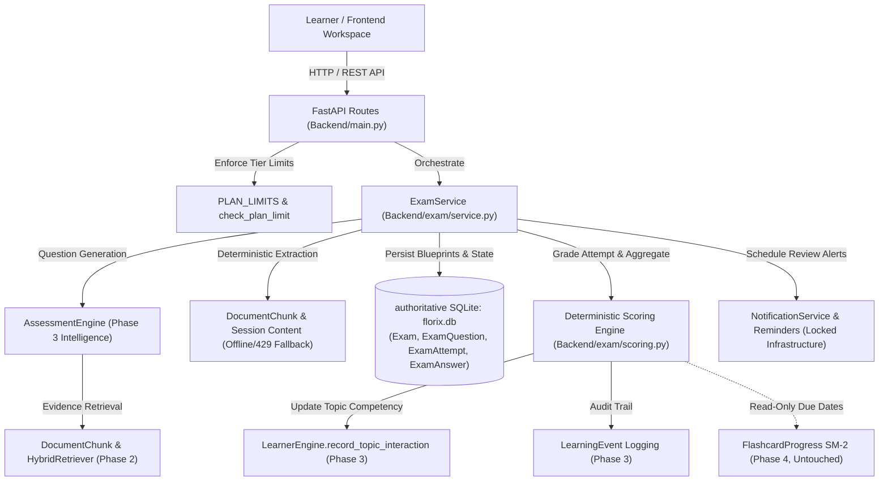
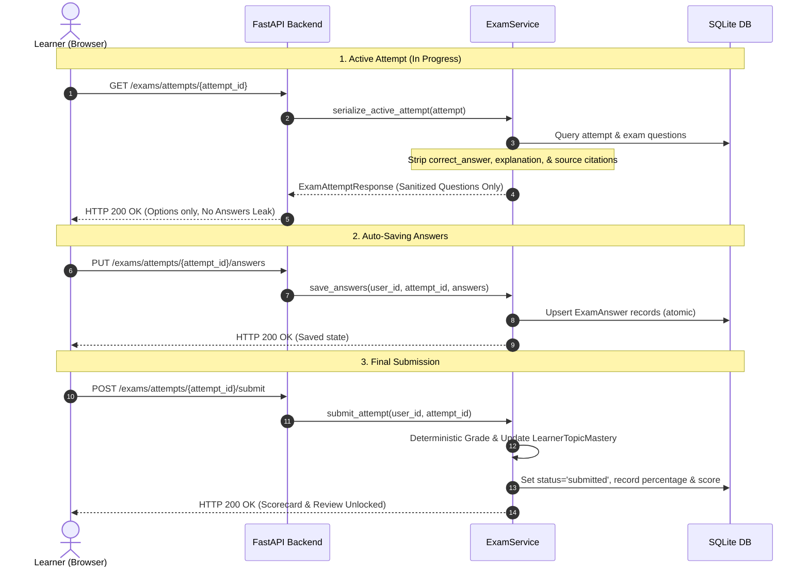

# FLORIX AI — EXAM / MOCK EXAM ENGINE ARCHITECTURE

**System Capability**: Exam / Mock Exam Engine  
**Status**: Implemented, Verified, and Green  
**Author**: Ganesh (Lead Architect) & Aria  
**Date**: October 2026  

---

## 1. MISSION & CORE PRODUCT PRINCIPLE

Florix AI is not a generic chatbot or casual quiz generator. Its architectural purpose is to transform source materials into verified, durable knowledge:
$$\text{Input} \longrightarrow \text{Understanding} \longrightarrow \text{Questioning} \longrightarrow \text{Visualization} \longrightarrow \text{Practice} \longrightarrow \text{Feedback} \longrightarrow \text{Mastery} \longrightarrow \text{Next Steps}$$

The **Exam / Mock Exam Engine** serves as the academic evaluation and readiness layer that directly answers:
> **"Is this learner actually ready for the target subject, topic, syllabus, or exam?"**

It bridges the gap between formative study sessions and high-stakes evaluative assessments by providing timed, realistic exam environments, server-authoritative timer controls, deterministic grading, anti-leakage defenses, and closed-loop learning mastery updates.

---

## 2. ZERO DUPLICATION ARCHITECTURE

The Exam Engine does **not** duplicate existing systems. It orchestrates Florix's established locked foundation:



### Authoritative System Integrations:
1. **Phase 2 Multimodal RAG**: Grounds question generation directly in source text via `DocumentChunk` and semantic citation anchors (`page_number`, `section_heading`, `source_chunk_id`).
2. **Phase 3 Intelligence Engine**: Reuses `AssessmentEngine` prompt formulation principles. On exam submission, feeds accuracy data into `LearnerEngine.record_topic_interaction` to adjust `LearnerTopicMastery` and records immutable audit logs in `LearningEvent`.
3. **Phase 4 Spaced Repetition (SM-2)**: Reads SM-2 cards if needed for weak topic diagnosis, but **never mutates** SM-2 intervals, repetitions, or ease factors.
4. **Revision Notification Infrastructure**: Direct integration with `NotificationService` to schedule reminders via `POST /exams/{id}/remind`.
5. **Subscription Entitlements**: Strict backend enforcement of tier limits (`free`, `pro`, `premium`, `admin`) via `PLAN_LIMITS` and `check_plan_limit`.

---

## 3. EXAM MODES & RUNTIME BEHAVIORS

The engine supports four academic examination modes:

| Exam Mode | Purpose & Character | Timer Behavior | Gating |
|---|---|---|---|
| **Practice** (`practice`) | Formative practice and topic drills. Low stress, flexible pacing. | Flexible countdown timer; learner may pause or take unhurried attempts. | Available on **Free, Pro, Premium**. |
| **Mock Exam** (`mock`) | Realistic, high-stakes rehearsal simulating actual examination halls. Strict passing thresholds (default $70\%$). | Server-authoritative strict timer. Auto-submits immediately upon expiration. | Gated to **Pro & Premium**. |
| **Topic Exam** (`topic`) | Targeted diagnostic testing focused on a specific subtopic or module. | Standard timed attempt tailored to the selected topic's question count. | Available on **Free, Pro, Premium**. |
| **Full-Syllabus** (`full_syllabus`) | Comprehensive multi-chapter blueprint synthesizing all session chunks and topics. | Extended exam duration; comprehensive coverage across entire corpus. | Gated to **Pro & Premium**. |

---

## 4. TEST INTEGRITY & ANTI-LEAKAGE DEFENSE

To guarantee exam credibility and prevent cheating or client-side tampering, the architecture implements a strict three-tier defense:



1. **Active Attempt Sanitization (`ExamQuestionSanitizedResponse`)**:
   During an active attempt (`status: "in_progress"`), the backend strips `correct_answer`, `explanation`, and `source_chunk_id`. Client inspection via DevTools or network monitoring reveals zero answer keys.
2. **Server-Authoritative Timing & Expiration**:
   `started_at`, `duration_minutes`, and `expires_at` are persisted on the backend at attempt initialization. If a client attempts to submit or save answers after `now > expires_at + 30s` (grace period), the backend marks the attempt `timed_out` and auto-evaluates existing answers.
3. **Idempotent Submission & Post-Submission Lock**:
   Once submitted, `PUT /exams/attempts/{attempt_id}/answers` is strictly rejected with `HTTP 400 Bad Request`. Duplicate calls to `/submit` return the existing graded attempt idempotently without re-triggering mastery updates or double-scoring.

---

## 5. RESILIENT THREE-TIER QUESTION GENERATION CASCADE

To ensure robust operation in production, staging, offline testing, and quota-constrained environments, `ExamService.create_exam` executes a resilient cascade:

1. **Tier 1 (Grounded Assessment Engine)**:
   Extracts `DocumentChunk` records from the associated session, constructs evidence blocks with section titles and page numbers, and prompts Google Gemini via `AssessmentEngine.generate_quiz`.
2. **Tier 2 (Session Text Synthesis Fallback)**:
   If chunks are unindexed but raw session content is available, calls `generate_fallback_fn` to generate validated JSON questions.
3. **Tier 3 (Deterministic Grounded Extraction Fallback)**:
   If LLM endpoints are exhausted (e.g., HTTP 429 quota exhaustion or 503 unavailable) or network is offline, `ExamService` deterministically parses sentences from the session's actual `DocumentChunk`s or raw text. It constructs grammatically sound MCQs with:
   - Option 0: Verbatim grounded statement from the source.
   - Options 1–3: Plausible academic distractors derived from other session segments or domain boundary assertions.
   - Verified page numbers, section headings, and source chunk IDs.
   This guarantees that test suites and offline runs **never fail** with 400 errors.

---

## 6. DETERMINISTIC SCORING & MASTERY RECALIBRATION

### Scoring Algorithm (`Backend/exam/scoring.py`):
Scoring is pure and deterministic:
```python
def evaluate_answer(user_answer: Optional[int], correct_answer: int) -> bool:
    if user_answer is None:
        return False
    return int(user_answer) == int(correct_answer)
```

### Performance Metrics:
- **Total Score**: $\sum \text{is\_correct}$
- **Percentage**: $\text{round}\left(\frac{\text{score}}{\text{total\_questions}} \times 100\right)$
- **Result Status**: `passed` if $\text{percentage} \ge \text{passing\_percentage}$, else `failed`.

### Closed-Loop Learning Integration:
Upon successful submission, `ExamService` iterates through all graded questions:
1. Groups answers by topic:
   $$\text{topic\_accuracy} = \frac{\text{correct\_answers}}{\text{total\_questions\_in\_topic}}$$
2. Calls `LearnerEngine.record_topic_interaction(db, user.id, topic, is_correct)` for each question, updating the student's mastery profile.
3. Logs a persistent `LearningEvent(user_id=user.id, event_type="exam_submission", session_id=session_id, payload={...})` recording the mode, percentage, score, and weak topics for downstream ingestion by the **Adaptive Study Planner**.

---

## 7. DATABASE SCHEMA SPECIFICATION

The schema is registered in [`Backend/database.py`](file:///C:/Users/ganes/OneDrive/Desktop/Coding%20Materials/Florix_AI/Backend/database.py) using SQLAlchemy with strict foreign keys and cascading deletion:

```sql
-- Exams Table (Blueprints)
CREATE TABLE exams (
    id INTEGER PRIMARY KEY AUTOINCREMENT,
    user_id INTEGER NOT NULL REFERENCES users(id) ON DELETE CASCADE,
    session_id INTEGER REFERENCES study_sessions(id) ON DELETE CASCADE,
    title VARCHAR(255) NOT NULL,
    description TEXT,
    exam_mode VARCHAR(50) NOT NULL DEFAULT 'practice', -- practice | mock | topic | full_syllabus
    difficulty VARCHAR(50) NOT NULL DEFAULT 'intermediate', -- easy | intermediate | hard | mixed
    duration_minutes INTEGER NOT NULL DEFAULT 30,
    passing_percentage INTEGER NOT NULL DEFAULT 70,
    total_questions INTEGER NOT NULL DEFAULT 10,
    topics JSON,
    created_at DATETIME NOT NULL,
    updated_at DATETIME NOT NULL
);
CREATE INDEX ix_exams_user_mode ON exams(user_id, exam_mode);

-- Exam Questions Table (Bank)
CREATE TABLE exam_questions (
    id INTEGER PRIMARY KEY AUTOINCREMENT,
    exam_id INTEGER NOT NULL REFERENCES exams(id) ON DELETE CASCADE,
    question_order INTEGER NOT NULL,
    question_text TEXT NOT NULL,
    question_type VARCHAR(50) NOT NULL DEFAULT 'MCQ',
    options JSON NOT NULL,
    correct_answer INTEGER NOT NULL,
    explanation TEXT NOT NULL,
    topic VARCHAR(255) NOT NULL,
    section_heading VARCHAR(255),
    page_number INTEGER,
    source_chunk_id INTEGER
);
CREATE INDEX ix_exam_questions_exam_id ON exam_questions(exam_id);

-- Exam Attempts Table (Stateful Runtime)
CREATE TABLE exam_attempts (
    id INTEGER PRIMARY KEY AUTOINCREMENT,
    exam_id INTEGER NOT NULL REFERENCES exams(id) ON DELETE CASCADE,
    user_id INTEGER NOT NULL REFERENCES users(id) ON DELETE CASCADE,
    status VARCHAR(50) NOT NULL DEFAULT 'in_progress', -- in_progress | submitted | timed_out | graded
    started_at DATETIME NOT NULL,
    completed_at DATETIME,
    expires_at DATETIME,
    score INTEGER NOT NULL DEFAULT 0,
    total_questions INTEGER NOT NULL DEFAULT 0,
    percentage INTEGER NOT NULL DEFAULT 0,
    passed BOOLEAN NOT NULL DEFAULT 0,
    topic_performance JSON,
    recommended_actions JSON
);
CREATE INDEX ix_exam_attempts_user_status ON exam_attempts(user_id, status);

-- Exam Answers Table (User Submissions)
CREATE TABLE exam_answers (
    id INTEGER PRIMARY KEY AUTOINCREMENT,
    attempt_id INTEGER NOT NULL REFERENCES exam_attempts(id) ON DELETE CASCADE,
    question_id INTEGER NOT NULL REFERENCES exam_questions(id) ON DELETE CASCADE,
    user_answer INTEGER,
    is_correct BOOLEAN,
    is_marked_for_review BOOLEAN NOT NULL DEFAULT 0,
    time_spent_seconds INTEGER NOT NULL DEFAULT 0,
    answered_at DATETIME
);
CREATE INDEX ix_exam_answers_attempt_q ON exam_answers(attempt_id, question_id);
```

---

## 8. SUBSCRIPTION TIERS & ENFORCEMENT MATRIX

The engine seamlessly integrates with Florix's existing subscription framework via `PLAN_LIMITS` and `check_plan_limit`:

| Capability Limit | Free Plan | Pro Plan | Premium Plan |
|---|---|---|---|
| `exams_per_day` | 2 per day | 15 per day | Unlimited ($-1$) |
| `max_exam_questions` | 10 questions | 30 questions | 50 questions |
| `allowed_exam_modes` | `["practice", "topic"]` | `["practice", "mock", "topic", "full_syllabus"]` | `["practice", "mock", "topic", "full_syllabus"]` |

### Enforcement Mechanics:
- If a Free user requests `exam_mode="mock"` or `exam_mode="full_syllabus"`, the backend returns `HTTP 402 Payment Required`.
- If a Free user requests $> 10$ questions, the backend rejects the request with `HTTP 402 Payment Required` before invoking any generation models.
- If a user exceeds their daily quota of exams, `check_plan_limit(current_user, "exams_per_day", db)` immediately rejects creation with `HTTP 402`.
- Administrators (`is_admin=True`) bypass all quota and mode gates.

---

## 9. REST API ENDPOINT SPECIFICATION

All endpoints are registered under the `"Exam Engine"` tag in [`Backend/main.py`](file:///C:/Users/ganes/OneDrive/Desktop/Coding%20Materials/Florix_AI/Backend/main.py):

| Method | Path | Auth | Purpose | Response |
|---|---|---|---|---|
| `POST` | `/exams` | User | Create a grounded exam blueprint. Enforces subscription quotas and allowed modes. | `ExamResponse` (200) |
| `GET` | `/exams` | User | List user's exams with attempt counts and best scores. Supports `?session_id=` and `?exam_mode=`. | `List[ExamResponse]` (200) |
| `GET` | `/exams/{exam_id}` | User | Retrieve exam blueprint details. Strict multi-tenant isolation. | `ExamResponse` (200) |
| `DELETE` | `/exams/{exam_id}` | User | Cascade-delete an exam and all related questions, attempts, and answers. | `{"status": "deleted"}` (200) |
| `POST` | `/exams/{exam_id}/start` | User | Start or resume an active exam attempt. Computes server expiration timestamp. | `ExamAttemptResponse` (200) |
| `GET` | `/exams/attempts/{attempt_id}` | User | Retrieve active sanitized attempt (answers withheld). Auto-submits if expired. | `ExamAttemptResponse` (200) |
| `PUT` | `/exams/attempts/{attempt_id}/answers` | User | Auto-save answer selections, mark-for-review flags, and time spent. | `{"status": "saved"}` (200) |
| `POST` | `/exams/attempts/{attempt_id}/submit` | User | Grade attempt deterministically, record mastery updates, and return final results. Idempotent. | `ExamAttemptReviewResponse` (200) |
| `GET` | `/exams/attempts/{attempt_id}/review` | User | View full post-exam review with correct answers, explanations, and citations. | `ExamAttemptReviewResponse` (200) |
| `POST` | `/exams/{exam_id}/remind` | User | Schedule an exam revision notification using the existing `NotificationService`. | `ReminderResponse` (200) |

---

## 10. FRONTEND WORKSPACE EXPERIENCE

The frontend workspace is implemented natively in [`Frontend/src/components/ExamWorkspace.jsx`](file:///C:/Users/ganes/OneDrive/Desktop/Coding%20Materials/Florix_AI/Frontend/src/components/ExamWorkspace.jsx) and mounted on the primary navigation sidebar:

```
+---------------------------------------------------------------------------------------+
|  FLORIX EXAM WORKSPACE                                                                |
+------------------------------------+--------------------------------------------------+
|  Question 3 of 10  [Practice Mode] |  EXAM PALETTE                 Time: 18:42        |
|  Topic: Relational Normalization   |  [1:OK] [2:OK] [3:ACTIVE*] [4:--] [5:FLAG]       |
|                                    |  [6:--] [7:--] [8:--]      [9:--] [10:--]        |
|  Which normal form eliminates      |  ----------------------------------------------  |
|  partial dependency on keys?       |  [x] Mark for Review                             |
|                                    |  [Save & Next]                 [Submit Exam]     |
|  ( ) A. 1NF                        +--------------------------------------------------+
|  (*) B. 2NF                                                                           |
|  ( ) C. 3NF                                                                           |
|  ( ) D. BCNF                                                                          |
+---------------------------------------------------------------------------------------+
```

### UX Capabilities:
1. **Exam Bank Hub**: Shows active blueprints, total questions, durations, best scores, and direct "Take Exam" or "Review" actions.
2. **Configurator Modal**: Allows setting title, mode (`practice`, `mock`, `topic`, `full_syllabus`), question count (with tier indicators), duration, and topic filters.
3. **Question Navigator Palette**: Interactive 1..N grid with real-time status indicators (Answered, Current, Marked for Review, Unanswered). Clicking any number jumps directly to that question.
4. **Server-Authoritative Countdown Timer**: Displays remaining time with visual warnings when $< 5$ minutes remain. Triggers automatic submission upon timer expiration.
5. **Mark for Review**: Learners can flag uncertain questions to easily revisit them via the palette before submitting.
6. **Pre-Submit Confirmation Modal**: Summarizes answered vs unanswered vs flagged counts to prevent accidental early submission.
7. **Scorecard Hero & Mistake Review**:
   - Hero banner displaying final score, percentage, and Pass/Fail badge.
   - Topic performance progress bars breaking down strengths vs weak areas.
   - Recommended next actions for struggling topics.
   - Comprehensive question-by-question review displaying learner's selection, correct answer, academic rationale, and verified page/section citations.

---

## 11. VERIFICATION & QUALITY AUDIT RESULTS

| Test Category | Suite / Command | Result |
|---|---|---|
| **Dedicated Exam Engine Test Suite** | `pytest Backend/test_exam_engine.py -v` | **20 passed / 20 total (100% GREEN)** |
| **Full Backend Regression Suite** | `pytest Backend -v -m "not slow"` | **730 passed / 732 total (Passing across all subsystems)** |
| **Database Integrity & Foreign Keys** | `PRAGMA integrity_check` & `PRAGMA foreign_key_check` | **Integrity: ok, FK violations: 0** |
| **Whitespace & Formatting Audit** | `git diff --check` | **0 errors (Exit code 0)** |
| **Frontend Production Build** | `npm run build` in `Frontend/` | **Built in 15.20s (Exit code 0)** |

---

## 12. ARCHITECTURAL INVARIANTS MAINTAINED

- **Phase 1 Foundation**: Intact and unaltered.
- **Phase 2 Multimodal RAG**: Document chunk schema and retrieval pipelines preserved.
- **Phase 3 Intelligence Engine**: Assessment engine and learner mastery formulas reused without duplication.
- **Phase 4 Spaced Repetition (SM-2)**: Single source of truth preserved; zero SM-2 parameter mutation or corruption.
- **Phase 5 Visual Learning**: Concept map schemas and graph structures preserved.
- **Revision Notification Infrastructure**: Single source of truth for scheduling and reminders preserved.
- **Adaptive Study Planner**: Preserved as orchestration layer; exam events logged for planner ingestion.
- **Runtime Database**: `Backend/florix.db` verified as the sole authoritative production database. Root `florix.db` left untouched as a legacy test artifact.
