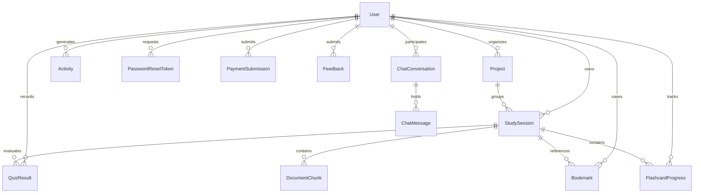

# FLORIX AI — ARCHITECTURAL CONTRACT & SYSTEM BASELINE
**Document Version**: 2.0.0-PROD  
**Author**: Ganesh (Lead Architect & Maintainer)  
**Status**: ACTIVE & PERMANENTLY BINDING  
**Core Directive**: UNDERSTAND FIRST → PRESERVE SECOND → IMPROVE THIRD

---

## 1. Executive Summary & Architectural Scope

Florix AI is an enterprise-grade academic study engine and intelligent research workspace developed over a 9-month iterative lifecycle. It couples multi-modal content ingestion (PDF, YouTube, Audio, Video, Web Links, and Raw Text) with Retrieval-Augmented Generation (RAG), dynamic study synthesis, interactive testing, cognitive flashcards, and an autonomous study assistant.

This contract defines the authoritative system boundaries, data contracts, route groups, database schemas, and architectural invariants. Any future modification, refactor, or feature addition MUST strictly conform to the specifications laid out in this document.

---

## 2. The Non-Negotiable Preservation Invariant

> **CRITICAL RULE**: THE EXISTING USER INTERFACE AND DESIGN SYSTEM ARE 100% FROZEN.
>
> 1. **Zero Redesigns / Zero Reskins**: No redesigns, aesthetic changes, color palette swaps, typography changes, or layout restylings are permitted without explicit written user authorization.
> 2. **Component Continuity**: All existing components (`Sidebar`, `Dashboard`, `StudyInput`, `StudySession`, `ChatPage`, `LibraryTab`, `PersonalizationTab`, `AdminPanel`, `PricingTab`) must retain their visual layout, Framer Motion transitions, and user interaction mechanics.
> 3. **Onboarding Visual Baseline**: The 4K laser pouring beam video (`/videos/onboarding-beam.mp4` / `.webm`) running with cloud lightning flashes, high-contrast typography (`INTELLIGENT WORKSPACE / FLORIX / Next-Gen Academic Engine`), and flat black container (`OnboardingFlow.savepoint.jsx`) is permanently locked as the baseline onboarding visual.
> 4. **Incremental Additions Only**: New features (such as Concept Graph, Visual Learning, Mastery Tracking) must cleanly integrate within the existing navigation and tab containers rather than disrupting existing views.

---

## 3. Technology Stack & Runtime Topology

| Layer | Technologies & Frameworks | Version / Runtime | Configuration Details |
| :--- | :--- | :--- | :--- |
| **Frontend Core** | React, Vite, Tailwind CSS | React 19.0, Vite 6.0 | Single Page Application (SPA), React Router v7 |
| **Animation & UI** | Framer Motion, Lucide React, Canvas-Confetti | Framer Motion 12.4 | Hardware-accelerated UI transitions & micro-interactions |
| **Visualization** | Recharts, PDF.js, React-Markdown | Recharts 2.15, PDFJS 5.4 | Charts, in-browser PDF rendering, GFM markdown parser |
| **Client Transport** | Axios, Server-Sent Events (SSE) | Axios 1.7 | Custom token interceptors, auto-recovery, and event streaming |
| **Backend Core** | FastAPI, Python, Uvicorn, Pydantic | Python 3.11+, FastAPI 0.115 | Asynchronous ASGI framework, Lifespan state management |
| **Database & ORM** | SQLite, SQLAlchemy, SQLite JSON | SQLite 3, SQLAlchemy 2.0 | `florix.db` with WAL mode and schema auto-patching |
| **Vector Engine** | ChromaDB (Persistent) | ChromaDB 0.6.3 | Cosine distance, persistent collection: `florix_document_chunks` |
| **AI & Embeddings**| Google Generative AI (Gemini 2.5 / 1.5) | Gemini SDK 0.8.4 | `gemini-1.5-flash`, `gemini-2.0-flash`, `gemini-embedding-2` |
| **Security & Auth**| PyJWT, Passlib, Bcrypt, SlowAPI | HS256 JWT, RateLimiting | 7-day configurable JWT tokens, client-IP rate limiting |
| **Payments** | Razorpay SDK | Razorpay 1.4.1 | Automated signature verification + Manual UTR submission fallback |

---

## 4. Complete Backend Route Map (79 Endpoints)

The backend (`Backend/main.py`) provides 79 production API endpoints classified into 14 distinct functional route groups:

### 4.1 System & Lifecycle (5 Endpoints)
- `GET /` — API root status and version confirmation.
- `GET /health` — Multi-subsystem health check (SQLite, ChromaDB, Gemini API).
- `GET /admin/system-health` — Real-time server diagnostics (uptime, CPU, memory footprint).
- `GET /admin/metrics` — Aggregate traffic telemetry, endpoint latencies, and token counters.
- `GET /test-gemini` — Gemini API connectivity and latency probe.

### 4.2 Authentication & Identity (8 Endpoints)
- `POST /signup` — New user registration with bcrypt password hashing and Free tier initialization.
- `POST /login` — Password authentication returning HS256 JWT bearer token.
- `POST /auth/oauth` — Social login bridge (Google / GitHub).
- `GET /me` — Current authenticated user profile with automatic expired plan downgrade.
- `PUT /me` — User profile update (display name, target exam, avatar selection).
- `DELETE /me` — Full GDPR account erasure (cascading purge across SQLite and ChromaDB).
- `POST /forgot-password` — Password reset token generator.
- `POST /reset-password` — Password reset fulfillment via validated reset token.

### 4.3 Content Ingestion & RAG Pipeline (7 Endpoints)
- `POST /upload` — Document upload (PDF, PNG, JPG, JPEG, WEBP) with background vectorization.
- `POST /upload-audio` — Audio lecture transcription and study guide generation.
- `POST /upload-video` — Video lecture transcription and study guide generation.
- `POST /process-link` — Web article scraping or YouTube transcript extraction and ingestion.
- `POST /process-text` — Direct raw text / lecture notes study guide synthesis.
- `POST /process-document` — Unified ingestion router for multi-format content.
- `GET /upload/stream/{progress_id}` — Server-Sent Events (SSE) RAG pipeline step tracker.

### 4.4 Study Engine & Persistence (7 Endpoints)
- `GET /study/{session_id}` — Complete study session retrieval (summary, key concepts, transcript).
- `PUT /study/{session_id}` — In-place study session modification and note editing.
- `DELETE /study/{session_id}` — Single session deletion with vector store cleanup.
- `DELETE /delete-session` — Alternate session deletion endpoint.
- `GET /session/{session_id}/audio` — Synthesized podcast / audio summary streaming.
- `GET /session/{session_id}/mindmap` — Hierarchical mindmap JSON tree generation.
- `POST /session/{session_id}/export-pdf` — Formatted PDF study guide export generator.

### 4.5 AI Testing & Assessment (4 Endpoints)
- `POST /generate_quiz` — Multi-difficulty multiple choice assessment generator.
- `POST /quiz-result` — Quiz submission evaluation, scoring, and analytics logging.
- `GET /quizzes/{session_id}` — Historical quiz attempt records for a specific session.
- `GET /user-quizzes` — Global quiz performance history for the authenticated user.

### 4.6 Active Recall Flashcards (6 Endpoints)
- `POST /generate_flashcards` — AI-synthesized flashcard deck generation.
- `GET /flashcards/{session_id}` — Flashcard deck retrieval for a study session.
- `POST /flashcards/{session_id}/progress` — SM-2 spaced repetition progress logger.
- `GET /flashcards/{session_id}/progress` — User mastery states for a session deck.
- `GET /flashcards/review/due` — Global list of flashcards due for review.
- `POST /flashcards/reset/{session_id}` — Deck mastery and review interval reset.

### 4.7 Conversational Intelligence & RAG Chat (5 Endpoints)
- `POST /chat` — Synchronous session-grounded RAG query using vector context.
- `POST /chat/stream` — Real-time token streaming RAG chat via SSE.
- `POST /conversations` — Multi-turn conversation thread creation.
- `GET /conversations/{conv_id}/messages` — Message history retrieval for a conversation.
- `POST /conversations/{conv_id}/messages` — Autonomous ReAct agent loop with tool execution.

### 4.8 Knowledge Vault & Library (8 Endpoints)
- `GET /library` — Paginated user study session library with filtering and sorting.
- `GET /library/{session_id}` — Detailed library session inspection.
- `PUT /library/{session_id}` — Session metadata, folder, and tag updates.
- `DELETE /library/{session_id}` — Library item deletion.
- `GET /search` — Fast lexical and title search across user study sessions.
- `POST /knowledge-vault/search` — Cross-session semantic vector search using embeddings.
- `POST /library/{session_id}/share` — Secure public/private share link generator.
- `GET /shared/{share_token}` — Unauthenticated read-only view for shared study content.

### 4.9 Bookmark System (3 Endpoints)
- `POST /bookmarks` — Content excerpt and concept bookmarking.
- `GET /bookmarks` — Authenticated user bookmark retrieval with session join.
- `DELETE /bookmarks/{bookmark_id}` — Bookmark removal.

### 4.10 Study Folders & Projects (5 Endpoints)
- `GET /projects` — User folder tree retrieval.
- `POST /projects` — New folder creation with custom icons and color tags.
- `PUT /projects/{project_id}` — Folder rename, icon change, or color update.
- `DELETE /projects/{project_id}` — Folder deletion with session unlinking.
- `POST /projects/{project_id}/sessions` — Move session into a target folder.

### 4.11 Subscriptions & Payments (8 Endpoints)
- `GET /subscription/status` — Current plan, usage quotas, and expiration timestamps.
- `POST /subscription/upgrade` — Instant tier upgrade router.
- `POST /payments/create-razorpay-order` — Razorpay server-side order generation.
- `POST /payments/verify-razorpay-payment` — HMAC-SHA256 Razorpay payment verification.
- `POST /payments/razorpay-webhook` — Razorpay automated event webhook handler.
- `POST /payments/submit-utr` — Manual UPI/Bank transfer UTR submission.
- `GET /payments/my-submissions` — User payment submission tracking.
- `GET /admin/payments` — Admin pending payment submission queue.

### 4.12 Admin Operations (7 Endpoints)
- `GET /admin/users` — Administrative user directory with plan and activity metrics.
- `PUT /admin/users/{user_id}/plan` — Direct user plan modification and quota override.
- `DELETE /admin/users/{user_id}` — Administrative user account deletion.
- `POST /admin/payments/{submission_id}/approve` — Manual payment approval and tier upgrade.
- `POST /admin/payments/{submission_id}/reject` — Manual payment rejection with reason logging.
- `GET /admin/feedback` — System feedback and issue reports list.
- `POST /admin/broadcast` — System-wide notification broadcast generator.

### 4.13 User Analytics & Activity (4 Endpoints)
- `GET /stats` — Dashboard statistics (sessions, quiz averages, study streaks).
- `GET /activity` — Recent user activity audit log with configurable day filters.
- `POST /feedback` — User feedback submission with sentiment capture.
- `GET /feedback` — User personal feedback history.

### 4.14 Document Processing Fallbacks (2 Endpoints)
- `POST /retry-chunking/{session_id}` — Re-run document chunking and vector storage.
- `GET /debug/collection-status` — ChromaDB vector collection diagnostics.

---

## 5. Database Schema & Data Models (`Backend/database.py`)

The persistent data layer uses SQLite (`florix.db`) accessed via SQLAlchemy ORM models:



### 5.1 Model Specifications
1. **`User`**: `id`, `name`, `email` (unique), `hashed_password`, `plan` (free/pro/premium), `plan_expires_at`, `is_admin`, `created_at`, `target_exam`, `study_preferences` (JSON), `streak_count`, `last_study_date`.
2. **`StudySession`**: `id`, `user_id` (FK), `filename`, `source_type` (pdf/audio/video/link/text), `summary`, `key_concepts` (JSON), `content`, `full_transcript`, `mindmap_data` (JSON), `category`, `project_id` (FK), `created_at`, `share_token` (unique), `is_public`.
3. **`DocumentChunk`**: `id`, `session_id` (FK), `chunk_index`, `text_content`, `embedding` (JSON SQLite fallback), `created_at`.
4. **`QuizResult`**: `id`, `user_id` (FK), `session_id` (FK), `score`, `total_questions`, `percentage`, `answers_detail` (JSON), `date_taken`.
5. **`FlashcardProgress`**: `id`, `user_id` (FK), `session_id` (FK), `card_index`, `interval`, `repetition`, `ease_factor`, `due_date`, `last_reviewed`.
6. **`ChatConversation`**: `id`, `user_id` (FK), `session_id` (FK, nullable), `title`, `created_at`, `updated_at`.
7. **`ChatMessage`**: `id`, `conversation_id` (FK), `role` (user/assistant/system), `content`, `created_at`.
8. **`Project`**: `id`, `user_id` (FK), `title`, `description`, `icon`, `color`, `created_at`.
9. **`Bookmark`**: `id`, `user_id` (FK), `session_id` (FK), `concept_title`, `excerpt`, `created_at`.
10. **`Activity`**: `id`, `user_id` (FK), `action`, `details`, `timestamp`.
11. **`PaymentSubmission`**: `id`, `user_id` (FK), `plan`, `amount`, `payment_method`, `transaction_id`, `status` (pending/approved/rejected), `created_at`.
12. **`Feedback`**: `id`, `user_id` (FK), `rating`, `category`, `message`, `created_at`.
13. **`PasswordResetToken`**: `id`, `user_id` (FK), `token` (unique), `expires_at`, `used`.

---

## 6. AI & RAG Engine Specifications

### 6.1 Chunking & Embedding Matrix
- **Text Chunking**: Sliding window algorithm via `chunk_text(text, chunk_size=800, overlap=150)`.
- **Embedding Model**: `models/gemini-embedding-2` (768 dimensions), batched in groups of 50 with exponential backoff retry.
- **Dual Vector Storage**:
  - **Primary**: ChromaDB PersistentClient (`chroma_db/`) using collection `florix_document_chunks`.
  - **Fallback**: SQLite `document_chunks.embedding` using pure Python cosine similarity calculations when ChromaDB is unavailable.

### 6.2 Identified Limitation: The 15,000-Character Truncation Barrier
- **Location**: `Backend/main.py:503` inside `generate_with_fallback(prompt, instruction)`:
  ```python
  truncated = prompt[:15000]
  ```
- **Architectural Impact**: Single-shot study guide synthesis caps input text at 15,000 characters (~3,000 words / ~3,750 tokens). Although Gemini 1.5/2.0 natively supports 1M+ tokens, documents exceeding 15k characters silently lose their rear sections during initial summary generation.
- **Remediation Path for Future Phases**: Transition to hierarchical map-reduce chunk summarization or full context-window streaming without regressing fallback stability.

---

## 7. Plan Entitlements & Subscription Tiers

Enforced server-side via `check_plan_limit(user, limit_type, db)` in `Backend/main.py`:

| Feature / Resource | Free Tier | Pro Tier (₹299/mo) | Premium Tier (₹499/mo) |
| :--- | :--- | :--- | :--- |
| **Study Sessions** | 5 total lifetime | 50 / month | Unlimited |
| **Max File Upload Size**| 10 MB | 50 MB | 100 MB |
| **Audio / Video Ingest**| Disabled | 15 mins / upload | 60 mins / upload |
| **AI Model Tier** | Gemini 1.5 Flash | Gemini 1.5 Pro | Gemini 2.0 Flash / Pro |
| **Semantic Search** | Basic keyword | Cross-session vector | Deep Knowledge Vault |
| **Quizzes & Flashcards**| 3 per session | Unlimited | Unlimited with SM-2 |
| **Mindmap Export** | Static JSON | High-res PNG & JSON | Interactive & SVG |
| **PDF Export** | Basic formatting | Watermark-free | Custom branded |

---

## 8. Permanent Safety & Regression Baseline

Prior to deploying any backend or frontend updates:
1. `npm run build` must compile cleanly in `Frontend/` with exit code 0.
2. `python -m pytest Backend/test_rag.py Backend/test_main.py Backend/test_api.py` must pass 100%.
3. `florix.db` migrations must preserve backwards compatibility via `patch_db.py` or explicit nullable column definitions.
4. UI component structures must not alter class names or layouts of frozen components.

---

## 9. Phase 2 Architecture Contract — Production-Grade Knowledge Engine & RAG

**Status**: COMPLETED & VERIFIED  
**Architecture Specification**: `FLORIX_RAG_ARCHITECTURE.md`

### 9.1 Core Invariants & Guarantees
1. **Modular Package Topology**: All RAG logic is strictly decoupled into `Backend/rag/`:
   - `models.py`: Canonical dataclasses (`EnrichedChunk`, `RetrievalCandidate`, `Citation`, `GroundedResponse`) and enums (`ProcessingStatus`, `ContentType`, `QueryIntent`).
   - `parser.py`: Multi-page structural parser, academic content classifier (code, math, tables, definitions, lists), and section builder.
   - `chunker.py`: Boundary-aware semantic chunker preventing fragmentation of code blocks, LaTeX formulas, and tables.
   - `retriever.py`: `HybridRetriever` coupling dense vector search with lexical exact-match via Reciprocal Rank Fusion (RRF) and strict `user_id` multi-tenant isolation.
   - `reranker.py`: `RelevanceReranker` applying query intent boosts and Jaccard word-overlap deduplication ($\ge 0.70$).
   - `context_builder.py`: Explicit `[SOURCE X: ...]` context assembler producing structured citation maps.
   - `prompts.py`: Strict zero-fabrication academic prompts enforcing bracketed citation notation (`[1]`, `[2]`).
   - `generator.py`: Grounded generator supporting synchronous generation and SSE streaming with exponential backoff retry.

2. **Multi-Tenant User Isolation**:
   - Every chunk indexed in ChromaDB and SQLite MUST carry the authenticated user's `user_id`.
   - Every retrieval query to ChromaDB MUST filter by `{"user_id": user_id}`.
   - Cross-user retrieval is strictly prohibited at both vector and relational layers.

3. **Database Schema Additions**:
   - `study_sessions`: `processing_status`, `processing_error`, `page_count`, `char_count`, `doc_metadata`.
   - `document_chunks`: `page_number`, `section_heading`, `content_type`, `chunk_metadata`.
   - All columns are strictly nullable to guarantee full backward compatibility with pre-existing records.

4. **Verification Evidence**:
   - Backend unit and integration tests: 43 passed, 0 failed across `test_rag.py`, `test_main.py`, and `test_api.py`.
   - Frontend production build: `npm run build` completed cleanly with exit code 0.

---

## 10. Phase 3 Architecture Contract — Intelligent Learning Engine & Adaptive Study System

**Status**: COMPLETED & VERIFIED WITH LIMITATIONS  
**Architecture Specification**: `FLORIX_INTELLIGENCE_ARCHITECTURE.md`

### 10.1 Core Invariants & Guarantees
1. **Single Unified Architecture**:
   - Phase 3 strictly builds on and consumes the Phase 2 RAG subsystem (`Backend/rag/`).
   - Zero secondary vector stores, zero secondary embedding models, and zero duplicated retrieval pipelines.
2. **Modular Package Topology**:
   - `Backend/intelligence/models.py`: Strongly typed Enums (`LearningIntent`, `TeachingMode`, `QuestionType`) and schemas (`GroundedQuizQuestion`, `GroundedFlashcard`, `TopicMasteryRecord`, `IntelligenceResponse`).
   - `Backend/intelligence/intent.py`: Fast deterministic intent and teaching mode classifier.
   - `Backend/intelligence/teaching.py`: Pedagogical scaffolding structures (Beginner, Exam, Advanced, Interview, Revision) and concept extraction routines.
   - `Backend/intelligence/assessment.py`: Evidence-grounded quiz and flashcard generators maintaining 100% backward-compatible schemas with frontend components.
   - `Backend/intelligence/learner.py`: Explainable mathematical mastery calculation ($0.50A + 0.25R + 0.15N + 0.10D$), weak topic detection, and spaced revision scheduling.
   - `Backend/intelligence/validators.py`: Strict citation post-processing to strip hallucinated citation indices (`[99]`) and reject out-of-scope/unsupported queries.
   - `Backend/intelligence/orchestrator.py`: Central coordination pipeline for query routing and grounded validation.
3. **Database Evolution**:
   - Additive tables `learner_topic_mastery` and `learning_events` created in `Backend/database.py` and applied via `Backend/patch_db_phase3.py`.
   - Existing 13 tables and rows preserved 100% intact with zero destructive migrations.
4. **Security & Ownership**:
   - All learning endpoints (`/learning/mastery/{session_id}`, `/learning/weak-topics/{session_id}`, `/learning/evaluate-answer`) are strictly authenticated and enforce `StudySession.user_id == current_user.id`.
   - Cross-user access returns HTTP 404.
5. **Verification Evidence**:
   - Complete backend test suite: 56 passed, 0 failed across `Backend/test_rag.py`, `Backend/test_main.py`, `Backend/test_api.py`, and `Backend/test_intelligence.py`.
   - Frontend production build: `npm run build` compiled cleanly with exit code 0.


