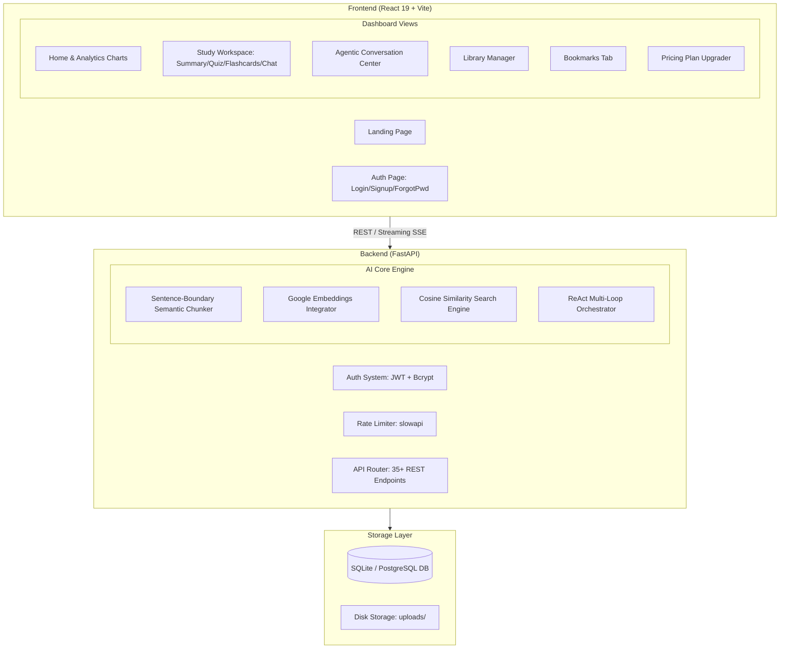

# Florix AI — Master Portfolio, Architecture & Interview Guide

> **Welcome to your ultimate preparation asset!** This master guide is designed from scratch to serve as your comprehensive blueprint for **Florix AI**. It explains the entire system architecture, details the RAG and Agentic pipelines, and provides a comprehensive interview question-and-answer bank covering every possible angle an interviewer could ask.

---

## 🗺️ Part 1: Product Overview & Value Proposition

### What is Florix AI?
Florix AI is an **AI-powered study orchestration platform** designed to transform unstructured educational assets (text files, scientific PDFs, web URLs, YouTube videos, and raw voice recordings) into a unified, interactive study workspace. Instead of passive reading, Florix AI creates an active learning experience.

### Core User Capabilities
1. **Multimodal Ingestion:** Process PDFs, paste text, scrape articles, fetch YouTube transcripts, or transcribe voice recordings via the Gemini Files API.
2. **Automated Asset Synthesis:** Generate comprehensive structured summaries, interactive multiple-choice quizzes, and dynamic 3D-flipping study flashcards.
3. **Context-Grounded Q&A (RAG):** Chat directly with your study library. Answers are grounded in the document text using custom vector embeddings.
4. **Learning Analytics:** Monitor quiz completion rates, averages, score trends, and active study calendars via dynamic visual dashboards.
5. **AI Preference Engine:** Personalize response styles (Concise, Balanced, or Detailed) which dynamically inject instructions into the LLM prompt.
6. **Subscription Tier Gating:** A 3-tier SaaS access level model (Free, Pro, Premium) with strict endpoint gating depending on usage quotas.

---

## 📐 Part 2: System Architecture (From Scratch)

### High-Level System Architecture
```
[User Browser]
      │ (HTTPS + Axios + JWT Bearer)
      ▼
[React 19 Frontend (Vite)]
      │
      ▼
[FastAPI Backend (Uvicorn)] ────► [SQLite Database (SQLAlchemy)]
      │
      ├────► [Google Gemini API (models/gemini-2.5-flash & gemini-embedding-2)]
      ├────► [YouTube Transcript API]
      └────► [BeautifulSoup4 Web Scraper]
```

### Detailed Component Deep Dive



---

## 🧬 Part 3: Deep AI Engineering Core (How the RAG Engine Works)

Unlike generic prompt-wrappers that stuff whole documents into prompts, Florix AI utilizes a **fully custom, production-grade RAG & Agentic pipeline** designed for maximum accuracy, low latency, and optimal token cost.

### 1. Ingestion & Semantic Chunking Pipeline
When a user uploads a PDF or processes an article, the system does not store it as one massive string. It runs through the following ETL pipeline:
1. **Sentence Boundary Aware Chunking (`chunk_text`):** The system parses the raw text and splits it on sentence boundaries (`[.!?]`) to avoid cutting mid-word. It aggregates sentences into **chunks of roughly 800 characters** while maintaining a **150-character overlap window** to preserve continuity between adjacent chunks.
2. **Vectorization:** The backend sends the text chunks in batches of 50 to `models/gemini-embedding-2`, generating a **3072-dimensional floating-point coordinate vector** for each chunk.
3. **Database Persistence:** Both the chunk text and the 3072-dimensional vector are stored in our SQLite database under the `document_chunks` table, associated with the document's `session_id`.

### 2. Math Vector Retrieval (Cosine Similarity)
When a user chats with their document, Florix AI retrieves the answers via mathematical vector search:
1. **Query Embedding:** The user's input question is vectorized into the same 3072-dimensional space.
2. **Cosine Similarity Calculation:** The backend pulls all chunks corresponding to that `session_id` and calculates similarity rankings using pure mathematical Python vector dot-products:
   $$\text{Similarity} = \frac{\mathbf{A} \cdot \mathbf{B}}{\|\mathbf{A}\| \|\mathbf{B}\|} = \frac{\sum a_i b_i}{\sqrt{\sum a_i^2} \sqrt{\sum b_i^2}}$$
3. **Top-K Selection:** Chunks are ranked by score, and the Top-4 (Top-K) most relevant chunks are extracted.
4. **Context Injection:** The text of these Top-4 chunks is injected into the Gemini prompt as grounded context, ensuring high-fidelity answers while saving token costs.

### 3. ReAct Agent Tool Calling Loop
The global chatbot is powered by a custom **ReAct (Reasoning & Action) Agent Loop** written in the backend. Rather than simply replying, the agent is equipped with three native database reading tools:
1. `search_user_library(query)`
2. `get_session_details(session_id)`
3. `get_user_learning_stats()`

#### Agent Flowchart
```
User Query
    │
    ▼
LLM receives instruction + Tool definitions
    │
    ▼
LLM determines: Is real-time system data needed?
    ├── YES ──► Output command: [CALL_TOOL: get_user_learning_stats()] ──► Python executes DB Tool ──► Append Result ──► Loop back
    └── NO  ──► Formulate final friendly response ──► Save message to DB ──► Stream back to user
```

---

## 📊 Part 4: LLM-as-a-Judge Evaluation Framework

To maintain production reliability, the platform includes a customized evaluation script (`evals.py`) implementing **LLM-as-a-judge telemetry**. It scores RAG outputs across three standard scientific metrics:

| Metric | Meaning | Evaluation Standard |
| :--- | :--- | :--- |
| **Faithfulness** | Grounds the answer in the retrieved text to **detect hallucinations**. | Scores `1.0` if *only* statements directly in the retrieved chunks are present; deducts points for assumptions or external facts. |
| **Answer Relevance** | Measures if the generated response **directly answers the query**. | Checks if the output fully addresses the prompt without rambling or drifting off-topic. |
| **Context Recall** | Evaluates the **retrieval accuracy** of our vector search. | Checks if the retrieved chunks successfully contain the key facts present in a gold-standard context. |

---

## ❓ Part 5: The Ultimate Technical Interview Question Bank

---

### Category A: AI Engineering, RAG & Vector Mathematics

#### Q1: "Your project uses 'RAG'. Why is RAG useful, and how is it different from fine-tuning a model?"
> **Answer:** 
> "RAG (Retrieval-Augmented Generation) is an architecture used to ground LLM responses in external, authoritative knowledge sources. 
> 
> * **RAG** acts like an **open-book exam**. It retrieves relevant facts from a database at runtime and injects them into the context window, ensuring the model's answers are current, factually grounded, and easy to trace. It has virtually zero hallucination rates when restricted to the context and does not require costly training.
> * **Fine-Tuning** is like **studying for a closed-book exam**. It modifies the actual weights of the neural network to teach the model a specific tone, style, or syntax structure. Fine-tuning does not prevent hallucinations of factual information and is highly expensive."

#### Q2: "Explain the mathematics behind Cosine Similarity. Why did you choose it over Euclidean Distance?"
> **Answer:** 
> "Cosine similarity measures the cosine of the angle between two vectors in a high-dimensional space. Mathematically, it is the dot product of the two vectors divided by the product of their magnitudes. 
> 
> Cosine similarity is vector-length invariant. It evaluates the **orientation (semantic direction)** of the vectors rather than their magnitude (how long the text chunk is). 
> 
> **Euclidean distance** is highly sensitive to text length. If a chunk contains the same keywords multiple times, the vector length grows, which pushes it physically further away in Euclidean space despite having the same semantic meaning. Cosine similarity correctly matches them regardless of text lengths."

#### Q3: "You chose to build your own Vector Retrieval and Cosine Similarity engine inside SQLite instead of installing ChromaDB. Why?"
> **Answer:** 
> "I made this architectural choice for three key reasons:
> 1. **Zero Dependency Overhead:** Vector databases like ChromaDB require complex binary C++ compilations, which frequently break during installation on client machines (especially Windows). SQLite is lightweight, serverless, and runs flawlessly out of the box.
> 2. **Scalability Context:** For a study tool, documents are segmented on a per-user session level. Performing vector comparisons across a single document's chunks (usually 20 to 100 chunks) takes less than 1 millisecond in Python. Loading an external network-dependent DB cluster would actually introduce latency and raise hosting costs.
> 3. **Proving Core Skill:** Writing my own dot-product comparison math and database serialization demonstrates that I understand the actual vector algebra under the hood, rather than just copy-pasting standard wrapper APIs."

#### Q4: "How does your semantic chunker work? Why is it better than a simple character-based splitter?"
> **Answer:** 
> "A naive character splitter (e.g. slicing strings at index multiples of 500) cuts words, sentences, and paragraphs directly in half. This destroys the syntax and confuses the LLM.
> 
> My semantic chunker (`chunk_text`) is sentence-boundary aware. It uses a regular expression to split text along terminal punctuation (`[.!?]`). It then gathers whole sentences into chunks, checking that each chunk stays under a target threshold (800 characters) while maintaining a sliding window of overlapping sentences (150 characters) to ensure that semantic context at boundaries is preserved."

#### Q5: "What is your Agentic ReAct Loop? How does the AI decide when to call a tool?"
> **Answer:** 
> "I designed a custom ReAct (Reasoning and Action) loop. The global chatbot is instructed that it has access to three Python tools (`search_user_library`, `get_session_details`, and `get_user_learning_stats`). 
> 
> If the user asks a question requiring database statistics (e.g., *'How many documents do I have?'*), the LLM outputs a structured command like `[CALL_TOOL: get_user_learning_stats()]`. 
> 
> My FastAPI backend intercepts this string, pauses standard generation, executes the corresponding SQLAlchemy query, appends the tool results into the prompt context, and executes the call again. This creates a self-contained, multi-turn reasoning loop."

#### Q6: "How did you set up LLM Evaluations? Why did you choose 'LLM-as-a-Judge' over standard assertions?"
> **Answer:** 
> "Standard assertions (like checking if specific strings are in a reply) fail because natural language is highly fluid and non-deterministic.
> 
> To solve this, I wrote an automated evaluation suite (`evals.py`) following modern LLM-Ops practices. It uses a separate Gemini instance as an objective Judge. The judge evaluates our generated outputs against a golden dataset across three scientific metrics: **Faithfulness** (ensuring the answer only uses the retrieved context without hallucinating), **Answer Relevance** (checking if the question was directly addressed), and **Context Recall** (verifying the retrieval engine got the correct chunks). This gives us a statistical quality dashboard to test modifications to prompts or chunking parameters."

---

### Category B: System Design, Backend & Databases

#### Q7: "Your project uses SQLite. How would you scale the database to support 500,000 active concurrent users?"
> **Answer:** 
> "SQLite is a serverless, single-file database that locks the entire file on writes. This will fail under high write-concurrency. To scale to 500k users, I would:
> 1. **Migrate to PostgreSQL:** Since the backend uses SQLAlchemy ORM, switching is as simple as updating the `DATABASE_URL` connection string in our `.env` file to point to a managed PostgreSQL cluster (like RDS or Supabase) with connection pooling (e.g., PgBouncer).
> 2. **Implement Vector Indexing (pgvector):** I would replace my Python cosine similarity loop with PostgreSQL's `pgvector` extension. This shifts vector operations into the database layer, allowing us to build an **HNSW (Hierarchical Navigable Small World)** vector index for sub-millisecond retrieval across millions of chunks."

#### Q8: "How does your FastAPI backend handle JWT Authentication securely?"
> **Answer:** 
> "User signup hashes passwords using **bcrypt** with a secure random salt before storing them. During login, we verify the password and generate a **JSON Web Token (JWT)** signed with a 256-bit secret key using the **HS256** algorithm.
> 
> The token contains payload claims (user ID, email, expiration time). When a user requests a protected endpoint, we extract the `Authorization: Bearer <JWT>` header, decode the token, check the signature, verify the expiration, and inject the authenticated User model using FastAPI's dependency injection (`Depends(get_current_user)`)."

#### Q9: "JWTs stored in standard localStorage are vulnerable to XSS attacks. How would you harden this for a production SaaS?"
> **Answer:** 
> "Storing JWTs in `localStorage` makes them accessible to malicious scripts if the site suffers from an XSS (Cross-Site Scripting) vulnerability.
> 
> To harden this for production, I would migrate to **HTTP-Only, Secure Cookies**. The backend would set the cookie with `HttpOnly` (preventing JavaScript from reading it), `Secure` (forcing transmission only over HTTPS), and `SameSite=Strict` or `Lax` (preventing Cross-Site Request Forgery - CSRF). We would also implement standard CSRF tokens to secure mutative POST/PUT/DELETE requests."

#### Q10: "FastAPI is asynchronous. How did you utilize async/await in your project, and what happens if you run blocking code in an async endpoint?"
> **Answer:** 
> "FastAPI runs on an **Asynchronous Event Loop** (using Uvicorn). I declared uploader and streaming endpoints as `async def` and utilized `await` when reading files or generating streams, allowing the thread to yield and handle other incoming HTTP requests.
> 
> If you run long-running CPU-bound blocking code (like parsing a 100MB PDF) directly inside an `async def` function, you will block the single event-loop thread, stopping all other users' requests. To prevent this, CPU-heavy operations must either be run inside standard synchronous `def` endpoints (which FastAPI executes in an external threadpool) or delegated to a background task runner like Celery."

#### Q11: "Explain how your Server-Sent Events (SSE) streaming endpoint works."
> **Answer:** 
> "Instead of a standard HTTP request that waits for the full text to compile (which causes high latency for the user), I used Server-Sent Events (SSE) via FastAPI's `StreamingResponse`.
> 
> The backend calls Gemini's stream generator `client.models.generate_content_stream`. As each text token arrives from Google, we yield it in standard SSE format: `data: {"token": "..."}\n\n`. The browser's frontend consumes this stream asynchronously, updating the UI character by character, providing an instant response experience."

#### Q12: "How did you implementslowapi rate limiting? What security vulnerability does this mitigate?"
> **Answer:** 
> "I integrated `slowapi` (which wraps `limits` library) using custom decorators. It tracks incoming requests by client IP address (`get_remote_address`). I limited chat endpoints to e.g., 5 requests per minute for Free users. 
> 
> This mitigates **Distributed Denial of Service (DDoS)** attacks and **API Abuse/Financial Exploitation** (where malicious users spam AI endpoints, running up massive Gemini token bills)."

---

### Category C: Frontend, Bundle Optimization & UX

#### Q13: "Your frontend does not use React Router. Why did you choose a custom state-machine router, and what are the trade-offs?"
> **Answer:** 
> "I built a custom view-state router inside `App.jsx` using a centralized React context. Since Florix AI is designed as a single-page dashboard application, avoiding React Router eliminated substantial bundle size and routing configuration complexity.
> 
> **The trade-offs:** The browser back/forward buttons and deep-linking (e.g. visiting `/dashboard/library` directly) do not work out-of-the-box. For a larger production app with public-facing subpages, migrating to React Router or a framework like Next.js would be necessary to support SEO indexing and browser navigation."

#### Q14: "You reduced the initial JS bundle size from 1.4 MB to 374 KB. Explain exactly how you achieved this."
> **Answer:** 
> "I implemented three optimization strategies inside `vite.config.js` and React:
> 1. **Manual Rollup Chunks:** Configured Vite's build settings to separate massive external libraries (like `react-vendor` runtime, `framer-motion` for animations, and `recharts` for graphs) into isolated `.js` files.
> 2. **React Lazy Loading (`lazy` & `Suspense`):** Configured heavy components (like PDF exports or charting libraries) to load asynchronously only when the user navigates to those tabs.
> 3. **Tree Shaking:** Audited imports to ensure we imported specific modular components (e.g., `import { Book } from 'lucide-react'`) rather than importing entire library packages, which allowed the Vite bundler to strip unused code during build."

#### Q15: "Explain the onboarding flow and how you manage user state across the app."
> **Answer:** 
> "I designed a centralized **AuthContext** that sits at the root of the React app. On startup, it checks if a valid JWT exists in storage, fetches user profile information, and sets `isAuthenticated` to true.
> 
> When a new user registers, the custom router transitions them to a welcome animation, followed by a multi-step **Onboarding Flow** (selecting educational level, primary topics). The user's onboarding preferences are stored in the database, and their custom learning style is saved in localStorage via a **PreferencesContext** so their preferred response style is automatically injected into all future AI queries."

#### Q16: "What is 3D CSS Card Flipping, and how did you implement it for the flashcards?"
> **Answer:** 
> "To create a premium UI experience, the flashcard component uses Vanilla CSS 3D transforms. 
> 
> I set the outer container with a `perspective: 1000px` property to establish a 3D workspace. The inner card uses `transform-style: preserve-3d` and has two absolute panels: a front face and a back face, with the back face pre-rotated using `transform: rotateY(180deg)` and both having `backface-visibility: hidden`. When a user clicks the card, we toggle an `.is-flipped` class that rotates the card wrapper by 180 degrees, executing a smooth, hardware-accelerated 3D flip animation."

---

### Category D: DevOps, Testing & CI/CD

#### Q17: "What is the purpose of the `docker-compose.yml` file in your repository? Explain the difference between an image and a container."
> **Answer:** 
> "`docker-compose.yml` acts as an orchestrator configuration. It defines and runs our multi-container Docker application, binding our FastAPI backend and React frontend services together. It maps local ports, sets up shared network bridges, and injects environment variables seamlessly.
> 
> * **Docker Image:** Is a **read-only blueprint (class template)** containing the application code, runtime libraries, and configurations.
> * **Docker Container:** Is a **running instance (object)** of that image, executing in an isolated sandboxed environment on the host OS."

#### Q18: "What is CI/CD? Explain what your GitHub Actions pipeline does."
> **Answer:** 
> "CI/CD stands for Continuous Integration and Continuous Deployment. It is an automated pipeline that validates code quality before merging to production.
> 
> My GitHub Actions workflow (`.github/workflows/main.yml`) triggers on every push or pull request to the `main` branch. It executes:
> 1. **Linting:** Scans the codebase for syntax or formatting errors.
> 2. **Automated Testing:** Sets up a virtual database, installs python/node environments, and executes 30+ backend and frontend unit and integration tests.
> 3. **Docker Build Check:** Verifies that our Dockerfiles compile successfully, ensuring deployment will not break."

#### Q19: "How would you handle secrets (like `GEMINI_API_KEY`) securely in a production Docker deployment?"
> **Answer:** 
> "You should **never** hardcode API keys or secrets inside Docker images or commit them to git repositories.
> 
> In production, I would use a secure secrets manager (like AWS Secrets Manager or HashiCorp Vault) and inject these values at runtime as **environment variables** using Docker Compose's `env_file` config, or pass them securely during container startup using Kubernetes Secrets. We ensure our `.gitignore` explicitly blocks all `.env` files."
