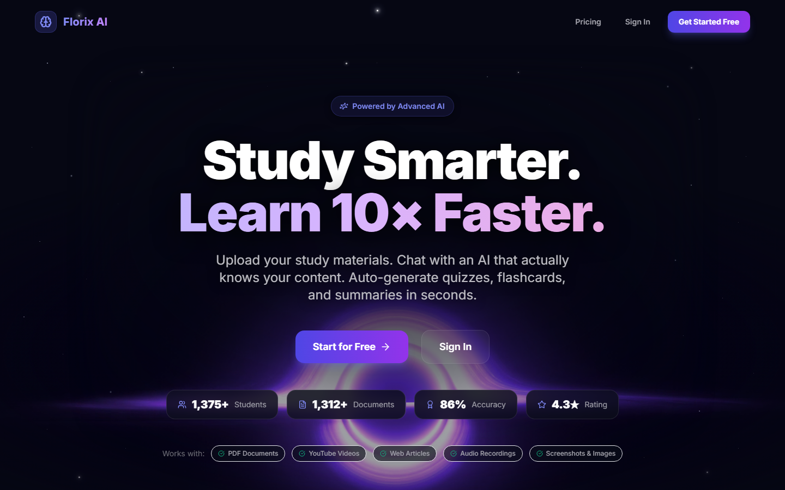
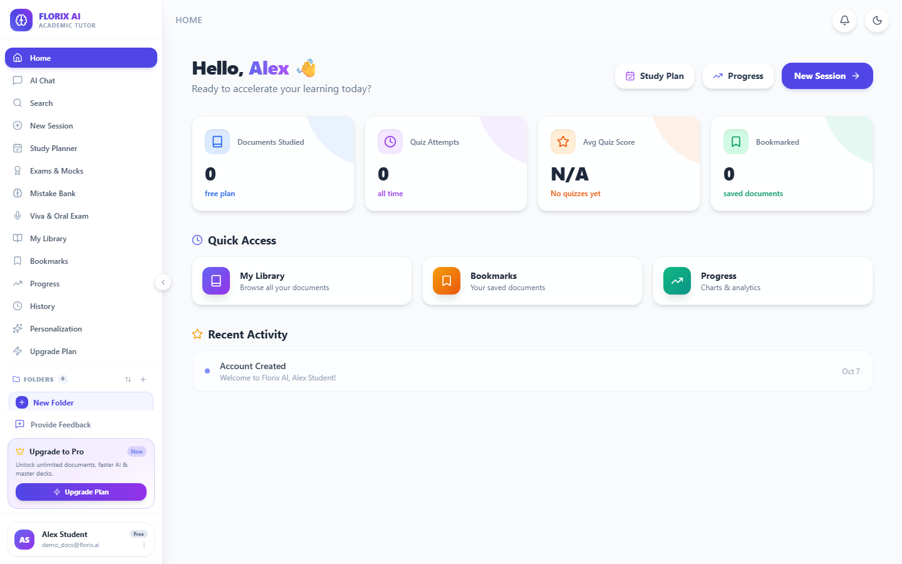
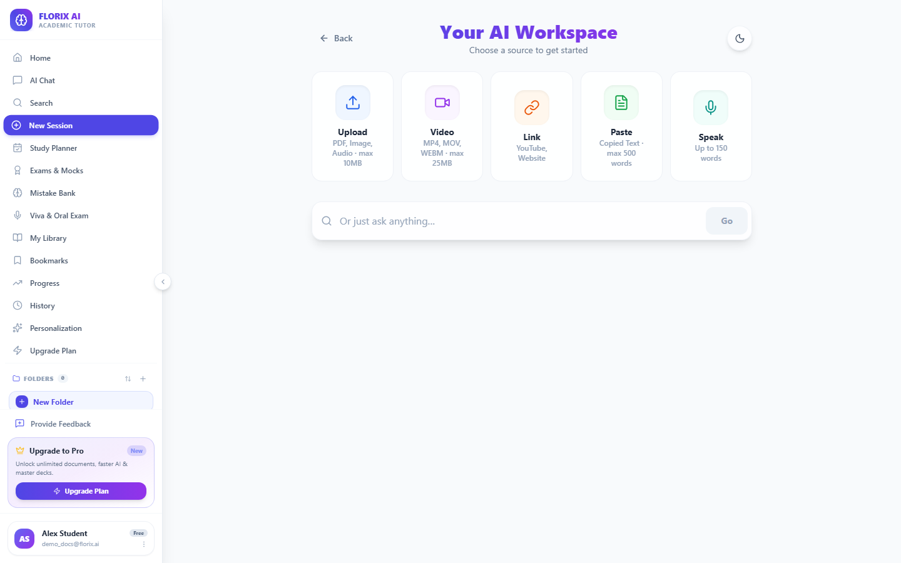
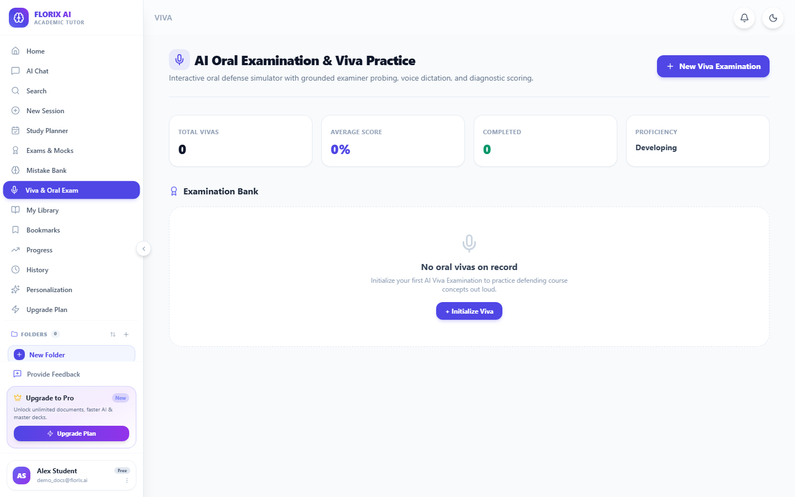
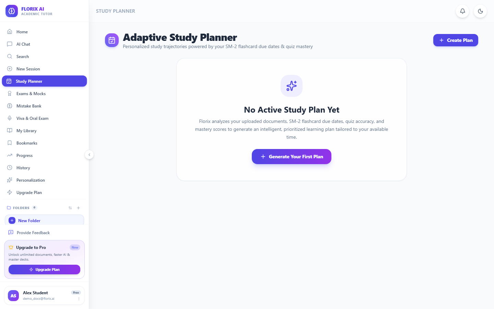

# Florix AI 🧠 — Production-Grade AI Study Orchestration Platform

[](https://florix-4rkmoj877-ganesh-y-s-projects.vercel.app)
[](https://opensource.org/licenses/MIT)
[](https://fastapi.tiangolo.com)
[](https://react.dev/)
[](https://tailwindcss.com/)
[](https://ai.google.dev/)
[](https://www.docker.com/)

> 🌐 **Live Web Application**: [https://florix-4rkmoj877-ganesh-y-s-projects.vercel.app](https://florix-4rkmoj877-ganesh-y-s-projects.vercel.app)  
> *Experience the full multimodal workspace, AI oral viva defenses, and adaptive study planner live in production.*

**Florix AI** is an enterprise-grade, full-stack AI learning and study orchestration platform. It converts unstructured educational resources—scientific papers, textbooks, YouTube lectures, web articles, voice recordings, and text notes—into structured, multimodal interactive study workspaces with grounded AI tutoring, spaced repetition planning, oral viva examinations, and cognitive mistake analytics.

---

## 📸 Product Walkthrough & Interface

### 1. Landing Experience
Modern glassmorphic interface designed with celestial depth and responsive motion.


### 2. Student Dashboard
Unified command center tracking active spaces, document mastery, analytics, and study streaks.


### 3. Multimodal Ingestion Workspace
Direct upload for PDFs, video lectures, YouTube URLs, web articles, and live voice dictation.


### 4. Interactive Viva & Oral Examination
Simulated AI-driven oral examinations with voice conversations, real-time rubric evaluation, and instant grading.


### 5. Adaptive Study Planner
SuperMemo-2 (SM-2) algorithm calculating dynamic retention schedules, urgency weights, and revision queues.


---

## 🚀 Key Technical Architectures

### 1. True In-Database RAG Engine
* **Sentence-Boundary Aware Semantic Chunker:** Segments documents using paragraph-regex separators (`~800` characters, `~150` sliding overlap) to preserve contextual boundaries.
* **Batch Vectorization:** Generates high-density 3072-dimensional vector coordinates via Google `gemini-embedding-2`.
* **Cosine Retrieval Engine:** Custom dot-product similarity ranking selecting top-K relevant chunks with context reranking to eliminate hallucinations.
* **Grounded Synthesis:** Injects retrieved context directly into the Gemini generation pipeline with strict academic grounding directives.

### 2. Adaptive Study Planner (SM-2 Spaced Repetition)
* Calculates cognitive intervals:
  $$\text{EF}' = \max\left(1.3, \text{EF} + (0.1 - (5 - q) \times (0.08 + (5 - q) \times 0.02))\right)$$
* Generates personalized daily study queues, urgency-weighted catch-up tracks, and cognitive fatigue pacing.

### 3. Interactive Viva & Oral Exam Engine
* Multi-stage voice examination system simulating live academic viva defenses.
* Follows structured Bloom's Taxonomy progression (Foundational $\rightarrow$ Analytical $\rightarrow$ Counter-Hypothetical).
* Provides granular criterion-based scoring across Conceptual Precision, Coherence, and Critical Thinking.

### 4. Metacognitive Mistake Intelligence
* Analyzes student test errors into structured taxonomies:
  * Conceptual Gaps
  * Calculation / Syntax Errors
  * Retrieval Failure
  * Misreading / Rushing
* Generates targeted remediation drills to correct systematic cognitive flaws before exams.

### 5. Visual Learning & Dynamic Diagramming
* Automated generation of interactive Mermaid flowcharts, concept maps, and architectural diagrams.
* Custom pan-and-zoom visual workspace with responsive layout algorithms.

---

## 🛠️ Tech Stack

| Layer | Technologies |
| :--- | :--- |
| **Frontend** | React 19, Vite, Tailwind CSS, Framer Motion, Lucide Icons, ReactMarkdown, remark-gfm, Recharts |
| **Backend** | FastAPI, Uvicorn, Python 3.11+, SQLAlchemy, Pydantic v2, SlowAPI |
| **AI / Embeddings** | Google Gemini 2.5 Flash, Gemini Embedding 2, YouTube Transcript API, PyPDF |
| **Database** | SQLite (with WAL mode) / PostgreSQL compatible |
| **Security** | JWT (HS256) session tokens, Bcrypt password hashing, Rate limiting |
| **DevOps** | Docker, Docker Compose, Nginx, GitHub Actions |

---

## 💻 Local Development Setup

### 1. Prerequisites
* **Node.js** v18+ and **npm**
* **Python** 3.11+
* Google Gemini API key from [Google AI Studio](https://aistudio.google.com/)

### 2. Clone & Setup Backend
```bash
git clone https://github.com/<your-username>/Florix_AI.git
cd Florix_AI/Backend

# Create virtual environment
python -m venv venv
# On Windows:
venv\Scripts\activate
# On Linux/macOS:
source venv/bin/activate

# Install dependencies
pip install -r requirements.txt

# Configure environment
cp .env.example .env
# Edit .env and insert your GEMINI_API_KEY and JWT_SECRET

# Start FastAPI server
python -m uvicorn main:app --host 127.0.0.1 --port 8000 --reload
```

### 3. Setup Frontend
```bash
cd ../Frontend

# Install dependencies
npm install

# Start Vite dev server
npm run dev
```
Open **[http://localhost:5173](http://localhost:5173)** in your browser.

### 4. Running Subsystem Test Suites
```bash
cd ../Backend
pytest test_adaptive_study_planner.py test_exam_engine.py test_mistake_intelligence.py test_viva.py -v
```

---

## 📄 License

This project is licensed under the **MIT License** — see the [LICENSE](LICENSE) file for details.

---

## 👥 Authors & Maintainers

* **Ganesh Yandigeri** — Lead Systems Architect & Developer ([LinkedIn](https://www.linkedin.com/in/ganesh-yandigeri-988821287))
