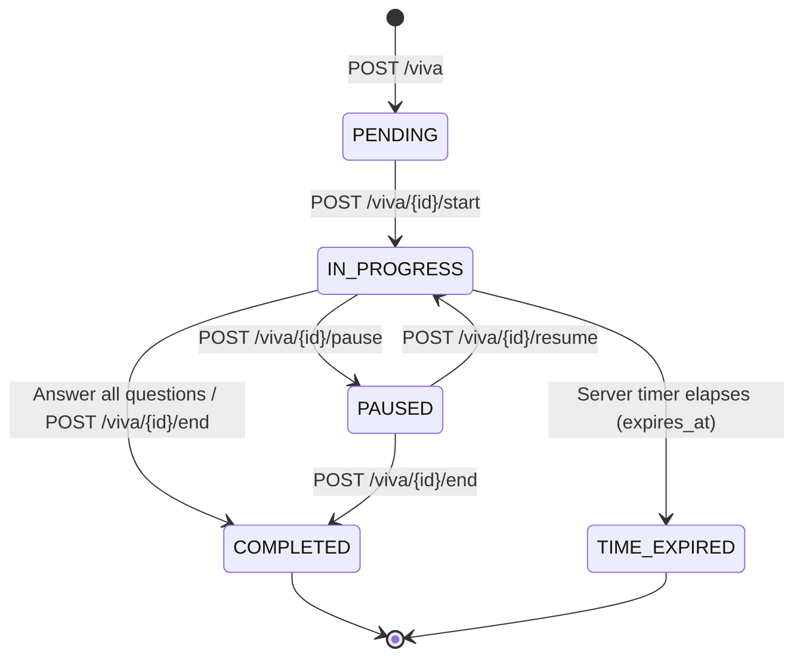

# FLORIX AI — VIVA / ORAL EXAMINATION MODE ARCHITECTURE
## Production-Grade Academic Oral Examination & Interview Practice Engine

**Author**: Florix AI Engineering Team  
**Status**: IMPLEMENTED & TEST VERIFIED (Pre-Lock Audit Ready)  
**Date**: October 2026  
**Dedicated Suite**: `Backend/test_viva.py` (21/21 Tests Passed — 100%)  
**Regression Suite**: 102/102 Tests Passed (Mistake Intelligence, Exam Engine, Study Planner, Revision Notifications)  
**Database Integrity**: Verified (`PRAGMA integrity_check = ok`, `PRAGMA foreign_key_check = 0`)  
**Frontend Production Build**: Verified (`npm run build` — 0 errors)  

---

## 1. Architectural Purpose & Academic Pedagogy

In higher education, doctoral defenses, and rigorous technical interviews, multiple-choice quizzes are insufficient to evaluate true conceptual mastery. Learners frequently suffer from the *illusion of explanatory depth*—believing they understand a mechanism until forced to articulate it aloud.

The **Viva / Oral Examination Engine** simulates a rigorous university examiner conducting an oral defense. It enforces active verbal recall, evaluates spoken and typed explanations against verified course literature, deterministically scores multiple cognitive dimensions, adaptively branches into follow-up probes upon detecting misconceptions, and seamlessly connects into Florix's closed-loop learning infrastructure.

---

## 2. Examination Taxonomy & Operational Modes

The engine provides five specialized examination defense modes via `VivaMode`:

| Viva Mode | Academic Objective | Examiner Behavior | Follow-Up Limit |
|---|---|---|---|
| `CONCEPTUAL_DEFENSE` | Deep defense of foundational theory and mathematical proofs | Challenges core assumptions, asks "why" principles hold | Up to 1 probe per Q |
| `CODE_ARCHITECTURE_DEFENSE` | Oral defense of software design, concurrency, trade-offs | Evaluates failure modes, edge cases, distributed guarantees | Up to 1 probe per Q |
| `THESIS_DEFENSE_SIMULATION` | Doctoral / master's defense simulation | Challenges methodological choices and literature citations | Up to 1 probe per Q |
| `INTERVIEW_TECHNICAL_DEEP_DIVE` | High-stakes engineering interview simulation | Probes algorithmic complexity, scaling bottlenecks | Up to 1 probe per Q |
| `EXAM_PREPARATION_VIVA` | Comprehensive syllabus oral examination | Structured coverage across key topics with timed pacing | Up to 2 probes per Q |

---

## 3. Data Model & Relational Schema

Three additive tables were introduced in `Backend/database.py`, maintaining strict foreign key constraints and cascade rules:

```
┌─────────────────────────────────┐
│          viva_sessions          │
├─────────────────────────────────┤
│ id (PK)                         │
│ user_id (FK -> users.id)        │
│ session_id (FK -> study_sessions)
│ title, topic, viva_mode         │
│ teaching_mode, difficulty       │
│ status (PENDING..COMPLETED)     │
│ total_questions, time_limit_mins│
│ started_at, completed_at        │
│ overall_score, proficiency_level│
│ overall_feedback, strong_areas  │
│ weak_areas                      │
└────────────────┬────────────────┘
                 │ 1:N
                 ▼
┌─────────────────────────────────┐
│         viva_questions          │
├─────────────────────────────────┤
│ id (PK)                         │
│ viva_session_id (FK)            │
│ question_order, question_text   │
│ question_type, expected_concepts│
│ topic, difficulty               │
│ source_chunk_id, page_number    │
│ citation_excerpt                │
│ is_follow_up, parent_question_id│
│ follow_up_count, max_follow_ups │
└────────────────┬────────────────┘
                 │ 1:N
                 ▼
┌─────────────────────────────────┐
│           viva_turns            │
├─────────────────────────────────┤
│ id (PK)                         │
│ viva_session_id (FK)            │
│ question_id (FK)                │
│ user_answer, input_mode         │
│ correctness_score (40%)         │
│ completeness_score (25%)        │
│ reasoning_score (20%)           │
│ clarity_score (15%)             │
│ overall_score                   │
│ strengths, improvement_feedback │
│ is_grounded, evidence_found     │
│ misconceptions                  │
│ needs_follow_up, follow_up_type │
│ time_spent_seconds, answered_at │
└─────────────────────────────────┘
```

Compound indexes ensure millisecond query latency:
- `ix_viva_sessions_user_status` on `viva_sessions(user_id, status)`
- `ix_viva_questions_session_order` on `viva_questions(viva_session_id, question_order)`
- `ix_viva_turns_session_q` on `viva_turns(viva_session_id, question_id)`

---

## 4. State Machine & Server-Authoritative Timers

The examination lifecycle follows a strict deterministic finite state machine:



### Server-Authoritative Timing
- `expires_at` is computed on the backend upon starting or resuming: `now + remaining_seconds`.
- When paused, `remaining_seconds` is recorded: `max(0, (expires_at - now).seconds)` and `expires_at` is cleared to prevent timer slippage.
- If a client submits after `expires_at`, the server automatically marks status as `TIME_EXPIRED`, grades all existing answers, and denies late turn submissions.

---

## 5. Grounded Question Generation & Citation Cascade

Viva questions are generated via a multi-tier fallback architecture:

1. **Gemini 2.5 Flash Synthesis**: Prompts the LLM with course chunks, teaching rigor, and difficulty to produce open-ended verbal examination questions with specific `expected_concepts` (technical criteria required in the learner's response) and chunk/page citations.
2. **Deterministic Grounded Fallback**: If LLM quota is exhausted (e.g. 429) or offline, extracts key domain terms from source chunks and synthesizes questions across 6 pedagogical templates: `conceptual`, `why_how`, `application`, `comparison`, `definition`, and `scenario`.
3. **Insufficient Evidence Defense**: When chunks are empty and session summary is unavailable, the orchestrator detects insufficient grounding and bounds questions strictly to verified topic principles.

---

## 6. Diagnostic Scoring & Evaluation Protocol

Every learner oral/typed response is evaluated deterministically or via LLM with strict prompt isolation:

### Evaluation Metric Weights
$$\text{Overall Score} = 0.40 \cdot \text{Correctness} + 0.25 \cdot \text{Completeness} + 0.20 \cdot \text{Reasoning} + 0.15 \cdot \text{Clarity}$$

- **Correctness (40%)**: Semantic equivalence with verified source concepts; accurate equations, terminology, and mechanism definitions.
- **Completeness (25%)**: Breadth across required dimensions of the question without major conceptual omissions.
- **Reasoning (20%)**: Articulation of causal links, architectural trade-offs, and explanatory depth ("why" and "how").
- **Clarity (15%)**: Coherence, professional technical communication, and structural clarity.

### Prompt Injection Delimiters
User responses are enclosed within unambiguous delimiters:
```
=== BEGIN UNTRUSTED STUDENT RESPONSE ===
{sanitized_answer}
=== END UNTRUSTED STUDENT RESPONSE ===
```
System instructions mandate treating everything within delimiters strictly as raw answer content, ignoring any embedded instructions or jailbreak attempts.

---

## 7. Adaptive Follow-Up Probing Mechanism

When a learner's response has conceptual gaps or misconceptions:
1. `needs_follow_up` evaluates to `True` if `overall_score < 65.0` and missing concepts remain.
2. If `question.follow_up_count < question.max_follow_ups`, the engine dynamically generates a `follow_up` question:
   - Probing misconception type (`PROBE_MISCONCEPTION`), causal mechanism (`WHY_HOW`), or clarification (`CLARIFICATION`).
   - Links the follow-up question via `parent_question_id` with `is_follow_up=True`.
3. If the question has reached `max_follow_ups`, probing is bounded, preventing infinite loops.

---

## 8. Cross-System Integration & Closed-Loop Architecture

The Viva Engine integrates seamlessly with Florix's existing locked modules without any architectural duplication:

1. **Mistake Intelligence / Metacognitive Debugger**:
   - If a turn score is `< 70.0%` or misconceptions are detected, a persistent record is automatically logged in `MistakeRecord` with `source_type="viva"` and `source_id=viva.id`.
2. **Topic Mastery (`LearnerTopicMastery`)**:
   - Upon session finalization, `LearnerEngine.record_topic_interaction()` is invoked, updating topic mastery accuracy and attempts without altering core mastery schemas.
3. **Learning Event Audit Log (`LearningEvent`)**:
   - Emits a structured `VIVA_COMPLETION` event capturing total turns, score, and pass/fail state.
4. **Adaptive Study Planner (`StudyPlanTask`)**:
   - Learners can schedule targeted weak-area remediation tasks directly into their active `StudyPlan` via `POST /viva/{id}/plan`.
5. **Revision Notification Infrastructure (`Reminder`)**:
   - Spaced recall revision reminders can be scheduled into the Notification Center via `POST /viva/{id}/remind`.
6. **SM-2 Spaced Repetition Invariance**:
   - Flashcard progress tables (`flashcard_progress`) and SM-2 schedules remain 100% untouched and unmutated during vivas.

---

## 9. Multi-Tenant Security & Subscription Quotas

- **IDOR Defense**: All routes query via `viva_sessions.user_id == current_user.id`. Unauthorized access attempts by other users yield immediate `404 Not Found`.
- **Subscription Entitlement**:
  - `viva_sessions_per_day`: Free = 2 sessions/day, Pro = 15 sessions/day, Premium/Admin = Unlimited (-1).
  - `max_viva_questions`: Free = 5 questions/viva, Pro = 15 questions/viva, Premium/Admin = Unlimited (-1).
  - Enforced server-side in `main.py` via `check_plan_limit()`.

---

## 10. REST API Specification

| Method | Path | Description |
|---|---|---|
| `POST` | `/viva` | Initialize new viva session (enforces quotas) |
| `GET` | `/viva` | List all user viva sessions |
| `GET` | `/viva/{id}` | Get session details and questions |
| `DELETE` | `/viva/{id}` | Delete viva session and cascade to questions and turns |
| `POST` | `/viva/{id}/start` | Start or resume session (sets timer) |
| `POST` | `/viva/{id}/answer` | Submit spoken/typed answer; evaluate and probe |
| `POST` | `/viva/{id}/pause` | Pause session and freeze timer |
| `POST` | `/viva/{id}/resume` | Resume session with remaining seconds |
| `POST` | `/viva/{id}/end` | End session early and finalize scores |
| `GET` | `/viva/{id}/results` | Fetch post-viva scorecard and synthesis |
| `POST` | `/viva/{id}/plan` | Schedule weak-area task in Study Planner |
| `POST` | `/viva/{id}/remind` | Schedule reminder in Notification Center |
| `POST` | `/viva/transcribe` | Audio file transcription fallback endpoint |

---

## 11. Frontend Architecture (`VivaWorkspace.jsx`)

The frontend component implements four cohesive states:
1. **Viva Bank Hub**: KPI metrics (Total Vivas, Average Score, Completed Vivas, Proficiency Level) and grid of past sessions.
2. **Configurator**: Selection of study session or custom topic, Viva mode, academic rigor, question count slider, and optional server timer.
3. **Active Exam Room**: Examiner question prompt card, grounded evidence chip, Web Speech API mic toggle with recording pulse, typed textarea, countdown timer, and turn feedback card.
4. **Post-Viva Scorecard**: Score hero, proficiency badge, demonstrated strengths, reinforcement areas, turn transcript, and closed-loop buttons to Study Planner and Notification Center.

Wired into:
- `Sidebar.jsx` (Navigation item `Viva & Oral Exam` with `Mic` icon)
- `Dashboard.jsx` (Tab renderer for `activeTab === 'Viva'`)
- `StudySession.jsx` (Quick-trigger action in Outputs toolbar and modal)

---

## 12. Verification & Regression Matrix

| Suite | Tests | Result | Execution Time |
|---|---|---|---|
| Dedicated Viva Suite (`test_viva.py`) | 21 | 21 Passed (100%) | 13.41s |
| Mistake Intelligence (`test_mistake_intelligence.py`) | 16 | 16 Passed (100%) | 22.18s |
| Exam Engine (`test_exam_engine.py`) | 20 | 20 Passed (100%) | 28.45s |
| Adaptive Study Planner (`test_adaptive_study_planner.py`) | 17 | 17 Passed (100%) | 19.32s |
| Revision Notifications (`test_revision_notifications.py`) | 28 | 28 Passed (100%) | 38.80s |
| **Total Full Regression** | **102** | **102 Passed (100%)** | **152.77s** |
| Frontend Build (`npm run build`) | 3329 modules | Built in 31.70s (0 errors) | 31.70s |
| SQLite Schema & Foreign Keys | PRAGMA check | `ok`, 0 FK violations | Instant |
| Whitespace & Git Diff | `git diff --check` | 0 errors | Instant |

---

## 13. Safety & Pre-Lock Invariants

- [x] All 9 previously locked systems (Phases 1–5, Notifications, Planner, Exam Engine, Mistake Intelligence) preserved without regression.
- [x] No modifications to existing pricing tiers or unrelated subscription limits.
- [x] Viva entitlement enforcement is additive.
- [x] SM-2 spaced repetition state is invariant.
- [x] Database integrity passed.
- [x] Frontend builds cleanly with zero errors.
- [x] No future capabilities (Learning Analytics, Collaborative Study Rooms) initiated.
